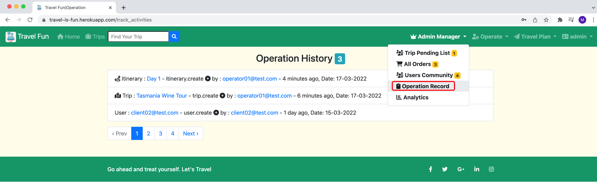
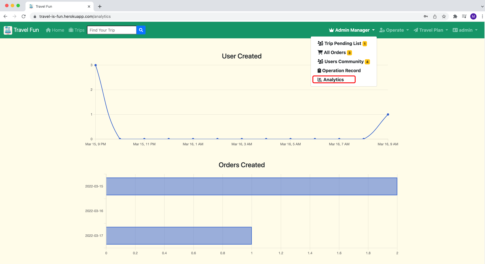

# T2A2 - Marketplace Project :kiss:
## Travel Fun Web Application :oncoming_bus:


## Identification of the problem you are trying to solve by building this particular marketplace app. :question:
- I worked as a manager in a travel company three years ago. I found that its business model is more like B2B for traditional travel companies. Most clients rely on a higher-level travel agency's introduction for my previous company. In this case, traditional travel companies cannot bring cheaper travel products to travellers because all travel products need to add commission fees by travel agencies. 

- The another point is that the order management is a little chaotic for my previous company. Sometimes, the operator needs to manually record their order in different excel sheets for various purposes. My last boss also worries about this situation. We have tried to find some programmers for designing an application or website for our company to solve this problem. But due to the high price, this problem has been put on hold again and again until I leave the company. 

- I've been wondering if there is an application that can directly display cheap travel products to guests and allow them to buy. It also can record the purchase data then automatically create analysis charts for the company marketing department. This application may not completely solve all problems, but it can alleviate them.

## Why is it a problem that needs solving? :bulb:
- I found that for traditional travel companies, the B2B business relationship is too fragile, especially after the pandemic,  many higher-level travel agencies closed down, in this situation, traditional travel companies are pretty difficult to show their travel products to guests who are keen to find travel plans. After jumping over the upper-level travel agency, the traditional travel company can bring more favourable product prices to the guests. The last point is that for the company's internal management, the charts and data provided by this website can also allow managers to better understand industry trends. 

- Therefore, the Travel Fun application comes. 

## A link (URL) to your deployed app (i.e. website) :globe_with_meridians:
<a href="https://travel-is-fun.herokuapp.com/" target="blank"> Travel Fun </a>

## A link to your GitHub repository (repo) :computer: 
<a href="https://github.com/lanceliumeng/travel-fun" target="blank"> Github Repo Link </a>

## Description of your marketplace app (website), including: TLDR :full_moon_with_face:

### Purpose :mega:
Travel Fun website tries to provide navigation for people who like to travel, let them know the playable options of the destination, and also provide a platform for the travel company, so that professional itinerary planning can be seen by more clients. At the same time, this website also provides an internal management system for the company, allowing the manager or director to see all travel orders at different cycles, etc.

### Functionality / features :star2:
- #### Feature 01: Users account
Travel Fun website allows users to create an account by email and password, they also need to click google reCAPTCHA to make sure each user account is created by real people. 

- #### Feature 02: Authentication & Authorisation by account roles
- if the user doesn’t want to create an account, that’s ok, you still can visit the website home page, the home page can let users know how many travel products do we have, how many professional trip designers do we have, and you can also find how many active accounts (our traveller and designer community) do we have. At home page, you also can find out popular trips, top-rated trips and the newest trips. 

- when the user wants to explore more things in Travel Fun website, you need to sign up first. After the user signs up, the admin account can based on your requirement, define your account role. Except for the admin account, the role of each newly registered account is client by default setting. 

- Authorisation relates to the user's account role. For the Travel Fun website, there are 3 user’s roles: admin, operator, and client. 
  - For Admin:
Admin has all the permissions of the website, including changing user roles, viewing all order statuses, viewing all user login statuses, all travel product operation statuses, and sales analysis. At the same time, he also has the operation authority of the operator role. The admin can approve the travel product, and only the approved product can be displayed on the client's page. If a travel product needs to be deleted, the admin needs to notify the creator（operator） to delete it, and the admin has no right to do so. This can prevent confusion in the company's operations at some extent.

  - For Operating users:
They can create travel products, upload pictures on the creation page, format the itinerary description through the rich text area to make it easier to read, and can choose travel plan language for different clients who have different cultural backgrounds, also operator can decide the duration and price for the travel product. After creating a new travel product, it needs to wait for the approval of the admin user. And operators can also see which user has purchased their own travel products, which is convenient to communicate with their clients at any time.

  - For client users:
After logging in to the website, they can not only see more details of travel products but also search for travel products according to their own needs. The search function includes allowing search by travel product title, introduction, language and price. And they also can sort based on the price and popularity of travel products from high to low. After purchases, clients can find the purchased products in the travel plan, and they can write reviews and tell us how they feel. The pending review area will notify clients if there is any travel product they forget to leave comments. 

- Since users with different permissions can see different interfaces, this can prevent users from performing unauthorized operations. If the user wants to perform an unauthorized operation by entering the url, he will receive a prompt from the website that the operation is invalid.

- #### Feature 03: create, update, read, delete  & image upload
As I said above, different users' permissions can do different crud operations.
Admin and operators can create travel products, also can update or delete products as needed. And only the product creator has the right to make subsequent updates and deletions. clients can leave a message on the purchased products to make the travel product more valuable.

- #### Feature 04: trackable by magic gem public_activity
include PublicActivity::Model in itinerary , trip and user model, to allow admin role account track operation history, incluse user account create, which operator did what to travel plan etc. 

### Sitemap :scroll:


### Screenshots :smiley_cat:

<details>
  <summary>Click Me to expand! - Landing Page</summary>

- #### landing page no log in
  
- signup page
  
- login page
  

</details>

<details>
    <summary>Click Me to expand! - Client User</summary>

- #### Client account log in
  - #### Clinet user landing page
  
  - #### Client user trip list page
  
  - #### Client user travel plan brought trips page
  
  - #### Client user travel plan pending review page
  

</details>

<details>
    <summary>Click Me to expand! - Operator User</summary>

- #### Operator account log in
  - #### Operator user landing page
  
  - #### Operator user trip list page
  
  - #### Operator user create trip page
  
  - #### Operator user created travel page
  
  - #### Operator user my client page
  

</details>

<details>
    <summary>Click Me to expand! - Admin User</summary>

- #### Admin account log in
  - #### Admin user landing page
  
  - #### Admin user trip list page
  
  - #### Admin user trip pending page
  
  - #### Admin user all orders page
  
  - #### Admin user users community page
  
  - #### Admin user operation history page
  
  - #### Admin user analytics page
  
  - #### Admin user create new trip page
  
  - #### Admin user created travel page
  
  - #### Admin user my client page
  

</details>

<details>
    <summary>Click Me to expand! - Accounting setting page</summary>


</details>

### Target audience :gem:
  - Travel company that want to find a platform which can not only save operator working time and automatically display itinerary to the client, then help them place an order faster, but also help for company management. 
  - People who want to find a suitable travel plan
  
### Tech stack :star:
<details>
    <summary> Tech Stack List:</summary>

- HTML5
- SCSS
- Font Awesome
- Bootstrap
- JavaScript
- jQuery
- Ruby
- Ruby on Rails
- PostgreSQL
- Balsamiq-Wireframes
- Lucidchart
- Heroku 
- Canva
- Postman
- AWS S3
- AWS IAM
  
</details>

## User stories :bookmark_tabs:

#### Users without login can view: 
- the user does not have to be signed in to view popular trips list, top-rated trips list and new trips list
 
#### Users need to log in then can have more authorities   
 - ##### When user account is client role account, then he can:
    - Buy travel plan
    - See what travel plan he bought
    - Write review for their own travel plan 
    - Users can search for trips
 - ##### When user account is operator role account, then he can:
    - Create travel plan, write content and upload image, also can add itinerary for travel plan
    - Edit their own travel plan 
    - Delete travel plan
    - Can see who brought their travel plan
    - Can see analytics for their created travel plan
 - ##### When user account is admin role account, then he can:
    - Admin can do what client role do
    - Admin can do what operator can do
    - Admin can check and approve all travel plans
    - Admin can see all orders
    - Admin can check each registered account status, edit any account roles
    - Admin can check each operation records for travel plan
    - Admin can check analytics for users created, orders created and so on

#### Users can log in and out

## Wireframes :clipboard:
[please find my wireframes in this link](docs/Wireframes/Wireframes-Travel-Fun.bmpr)

## Entity Relationship Diagram (ERD) :pushpin:


## Explain the different high-level components (abstractions) :pencil2:

#### Static_pages  MVC:
For Travel Fun home page, when user go to root route, StaticPagesController will run action landing_page,then the instance variables under the action will loading new_trips, purchased_trips, popluar_trips and top_rated_trips data to view page by layout. Landing_page and privacy_policy skip authentication, which means any user can check these pages. For static_pages controller, it also includes track activities and analytics actions, but these actions and views only for the current user have specific roles authorise. 
#### Trip, itinerary and order  MVC:
First of all, I have set before_action in above three controllers, generally, the private specific method will be called just before some actions. These specific methods are about find method, for exemple, for trip controller, set_trip 
```ruby
(@trip = Trip.friendly.find(params[:trip_id])) 
``` 
will be called before some actions, for the find method, Behind the scenes, it is automaticlly executing SQL:   
```sql
SELECT * FROM trips WHERE id = params id query.  
```
Application users even don’t have to concern themself with how they will interact with data but still can take specific data from database.. Ruby on Rails implements the Active Record pattern through ActiveRecord, included in every Rails application by default.
If user log in and try to create new trip , new itineraries or new order, the corresponding controllesrs will run create action, call params to access form & URL query data. Please note, in my routes file, you can find itineraries and orders routes are nested in trips route, That’s because each itinerary and order need to mapping specify trip. For trip controller, create action, only has one  POST request, new method will  pass a hash with key names matching the associated table column names, in this case, the pramas is trip_params private method, which includes title, description, beird info etc,  then use save method returns either true or false depending on whether the new  trip object was saved successfully to the database or not. At trip model file, I have set some validations, each data insert database before needs to achieve validation rules.  For new page will render form partial erb file which allows user complete new trip details.  For trips view, there are two partial files one is for trip form and another one is for each trip card details, The most important where partial comes into picture is when I want to reuse these component amongst different views, I just need to render these partial files. 

## Third Party Services :telescope:

#### Heroku 
Heroku is a container-based cloud Platform as a Service (PaaS), for my travel fun application, I set Heroku connect with my git repo, when I git push to update travel fun application, Heroku will automatically build up and deploy the application latest version base on my git repo codes.  
#### AWS S3
Amazon S3 (Amazon Simple Storage Service) is a service offered by Amazon Web Services that provides object storage through a web service interface. For travel fun application, every upload image will store in Amazon S3.
#### Google reCAPTCHA
reCAPTCHA is a free service from Google that helps protect websites from spam and abuse. A “CAPTCHA” is a turing test to tell human and bots apart. When users sign up, they need to pass reCAPTCHA check. 

## Models in terms of the relationships :door:

- Model Itinerary belongs to Model Trip, eg: a itinerary belongs to a trip. 
- Model Trip belongs to Model user, eg: a trip belongs to a user. 
- Model Trip has many Model itinerary and Model Order, eg: a trip has many itineraries and many orders. 
- Model Trip has one attached image,eg: a trip can include one image. 
- Model Order belongs to Model trip and Model user, eg: one order belongs to a trip and a user. 
- Model Role has and belongs to Model users, via an intermediate join table: users_roles, eg: a role has many users and a role can belong to a user. 
- Model User has many Model trip and Model order., eg: a user can have many trips and orders. 

## Database Relations :book:

- In trips table, it has a column which is user_id, it is foreign key in trips table. In users table, user_id is primary key. 
- In active_storage_attachments and active_storage_variant_records table, they have column blob_id, and it is foreign key, but in active_storage_blobs table, it is primary key. 
- In users_roles table, it includes two columns, user_id and role_id, they are foreign keys in here. But user_id is primary key in users table, role_id is primary key in roles table. 
- In Itineraries table, it has foreign key column: trip id, and trip id is primary key in trips table. 
- In orders table, it includes two columns: trip id and user id, they are foreign keys in here. But in trips table, trip id is primary key. In users table, user id is primary key. 

## Database Schema Design :memo:

```ruby
create_table "action_text_rich_texts", force: :cascade do |t|
    t.string "name", null: false
    t.text "body"
    t.string "record_type", null: false
    t.bigint "record_id", null: false
    t.datetime "created_at", precision: 6, null: false
    t.datetime "updated_at", precision: 6, null: false
    t.index ["record_type", "record_id", "name"], name: "index_action_text_rich_texts_uniqueness", unique: true
  end

  create_table "active_storage_attachments", force: :cascade do |t|
    t.string "name", null: false
    t.string "record_type", null: false
    t.bigint "record_id", null: false
    t.bigint "blob_id", null: false
    t.datetime "created_at", null: false
    t.index ["blob_id"], name: "index_active_storage_attachments_on_blob_id"
    t.index ["record_type", "record_id", "name", "blob_id"], name: "index_active_storage_attachments_uniqueness", unique: true
  end

  create_table "active_storage_blobs", force: :cascade do |t|
    t.string "key", null: false
    t.string "filename", null: false
    t.string "content_type"
    t.text "metadata"
    t.string "service_name", null: false
    t.bigint "byte_size", null: false
    t.string "checksum", null: false
    t.datetime "created_at", null: false
    t.index ["key"], name: "index_active_storage_blobs_on_key", unique: true
  end

  create_table "active_storage_variant_records", force: :cascade do |t|
    t.bigint "blob_id", null: false
    t.string "variation_digest", null: false
    t.index ["blob_id", "variation_digest"], name: "index_active_storage_variant_records_uniqueness", unique: true
  end

  create_table "activities", force: :cascade do |t|
    t.string "trackable_type"
    t.bigint "trackable_id"
    t.string "owner_type"
    t.bigint "owner_id"
    t.string "key"
    t.text "parameters"
    t.string "recipient_type"
    t.bigint "recipient_id"
    t.datetime "created_at", null: false
    t.datetime "updated_at", null: false
    t.index ["owner_id", "owner_type"], name: "index_activities_on_owner_id_and_owner_type"
    t.index ["owner_type", "owner_id"], name: "index_activities_on_owner"
    t.index ["recipient_id", "recipient_type"], name: "index_activities_on_recipient_id_and_recipient_type"
    t.index ["recipient_type", "recipient_id"], name: "index_activities_on_recipient"
    t.index ["trackable_id", "trackable_type"], name: "index_activities_on_trackable_id_and_trackable_type"
    t.index ["trackable_type", "trackable_id"], name: "index_activities_on_trackable"
  end

  create_table "friendly_id_slugs", force: :cascade do |t|
    t.string "slug", null: false
    t.integer "sluggable_id", null: false
    t.string "sluggable_type", limit: 50
    t.string "scope"
    t.datetime "created_at"
    t.index ["slug", "sluggable_type", "scope"], name: "index_friendly_id_slugs_on_slug_and_sluggable_type_and_scope", unique: true
    t.index ["slug", "sluggable_type"], name: "index_friendly_id_slugs_on_slug_and_sluggable_type"
    t.index ["sluggable_type", "sluggable_id"], name: "index_friendly_id_slugs_on_sluggable_type_and_sluggable_id"
  end

  create_table "itineraries", force: :cascade do |t|
    t.string "title"
    t.text "content"
    t.bigint "trip_id", null: false
    t.datetime "created_at", precision: 6, null: false
    t.datetime "updated_at", precision: 6, null: false
    t.string "slug"
    t.index ["slug"], name: "index_itineraries_on_slug", unique: true
    t.index ["trip_id"], name: "index_itineraries_on_trip_id"
  end

  create_table "orders", force: :cascade do |t|
    t.bigint "trip_id", null: false
    t.bigint "user_id", null: false
    t.integer "rating"
    t.text "review"
    t.integer "price"
    t.datetime "created_at", precision: 6, null: false
    t.datetime "updated_at", precision: 6, null: false
    t.string "slug"
    t.index ["slug"], name: "index_orders_on_slug", unique: true
    t.index ["trip_id"], name: "index_orders_on_trip_id"
    t.index ["user_id"], name: "index_orders_on_user_id"
  end

  create_table "roles", force: :cascade do |t|
    t.string "name"
    t.string "resource_type"
    t.bigint "resource_id"
    t.datetime "created_at", precision: 6, null: false
    t.datetime "updated_at", precision: 6, null: false
    t.index ["name", "resource_type", "resource_id"], name: "index_roles_on_name_and_resource_type_and_resource_id"
    t.index ["resource_type", "resource_id"], name: "index_roles_on_resource"
  end

  create_table "trips", force: :cascade do |t|
    t.string "title"
    t.text "description"
    t.datetime "created_at", precision: 6, null: false
    t.datetime "updated_at", precision: 6, null: false
    t.bigint "user_id", null: false
    t.string "slug"
    t.text "brief_info"
    t.string "language", default: "English", null: false
    t.string "duration", default: "5-Days-4-Nights", null: false
    t.integer "price", default: 0, null: false
    t.float "average_rating", default: 0.0, null: false
    t.integer "orders_count", default: 0, null: false
    t.integer "itineraries_count", default: 0, null: false
    t.boolean "published", default: false
    t.boolean "approved", default: false
    t.index ["slug"], name: "index_trips_on_slug", unique: true
    t.index ["user_id"], name: "index_trips_on_user_id"
  end

  create_table "users", force: :cascade do |t|
    t.string "email", default: "", null: false
    t.string "encrypted_password", default: "", null: false
    t.string "reset_password_token"
    t.datetime "reset_password_sent_at"
    t.datetime "remember_created_at"
    t.datetime "created_at", precision: 6, null: false
    t.datetime "updated_at", precision: 6, null: false
    t.integer "sign_in_count", default: 0, null: false
    t.datetime "current_sign_in_at"
    t.datetime "last_sign_in_at"
    t.inet "current_sign_in_ip"
    t.inet "last_sign_in_ip"
    t.string "slug"
    t.integer "trips_count", default: 0, null: false
    t.integer "orders_count", default: 0, null: false
    t.index ["email"], name: "index_users_on_email", unique: true
    t.index ["reset_password_token"], name: "index_users_on_reset_password_token", unique: true
    t.index ["slug"], name: "index_users_on_slug", unique: true
  end

  create_table "users_roles", id: false, force: :cascade do |t|
    t.bigint "user_id"
    t.bigint "role_id"
    t.index ["role_id"], name: "index_users_roles_on_role_id"
    t.index ["user_id", "role_id"], name: "index_users_roles_on_user_id_and_role_id"
    t.index ["user_id"], name: "index_users_roles_on_user_id"
  end

  add_foreign_key "active_storage_attachments", "active_storage_blobs", column: "blob_id"
  add_foreign_key "active_storage_variant_records", "active_storage_blobs", column: "blob_id"
  add_foreign_key "itineraries", "trips"
  add_foreign_key "orders", "trips"
  add_foreign_key "orders", "users"
  add_foreign_key "trips", "users"

```

##  The way tasks are allocated and tracked in my project :guitar:
[Trello Board](https://trello.com/b/VdF0mFNz/t2a2-travel-fun-ror-marketplace-project)

## Set Up Travel Fun :video_game:

- Make a fork of this repo
- Clone your fork to your local development environment
- Install dependencies bundle install
- Check node dependencies yarn install --check-files
- Run rails s and check that everything is working (you should see welcome to rails!)
- Ruby version: 2.7.5
- ROR version: 6.1.4.7
- Yarn version: 1.22.17
- Node version: v14.18.2